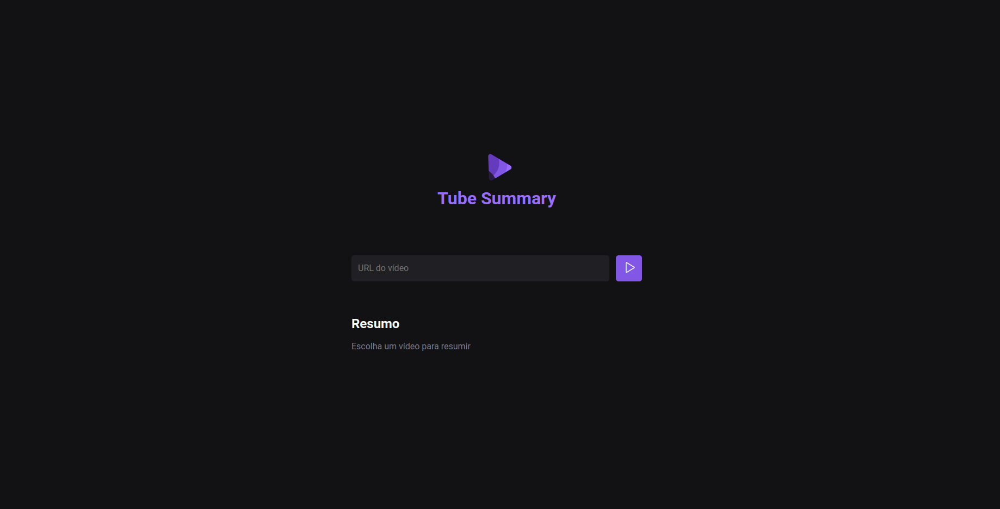

<h1 align="center"> Tube Summary </h1>

Minha versão da ultima nwl de 2023, promovido pela Rocketseat.  

  <a href="#-tecnologias">Tecnologias</a>&nbsp;&nbsp;&nbsp;|&nbsp;&nbsp;&nbsp;
  <a href="#-projeto">Projeto</a>&nbsp;&nbsp;&nbsp;|&nbsp;&nbsp;&nbsp;
  <a href="#memo-licença">Licença</a>

  

 

  

## 🚀 Tecnologias

Esse projeto foi desenvolvido com as seguintes tecnologias:

- HTML e CSS
- JavaScript
- Inteligência Artificial
- NodeJS
- Frameworks e Bibliotecas (outros)
- Git e Github
- Figma

## 💻 Projeto

Nwl é um projeto feito pela Rocketseat, de forma gratuita, de alguns dias de programação com um objetivo final.

- [Acesse a Rocketseat](https://www.rocketseat.com.br/)

## :memo: Licença

Esse projeto está sob a licença MIT.

---

Feito com ♥ by Rocketseat :wave: [Participe da nossa comunidade!](https://discord.gg/rocketseat)
